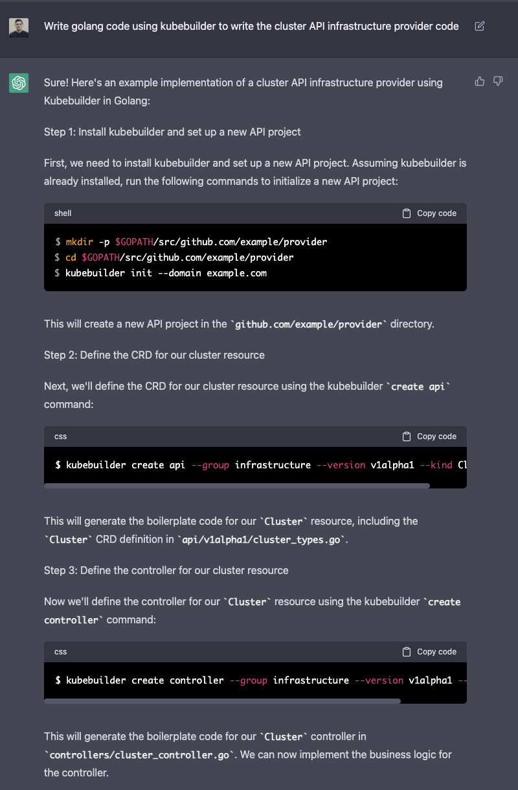
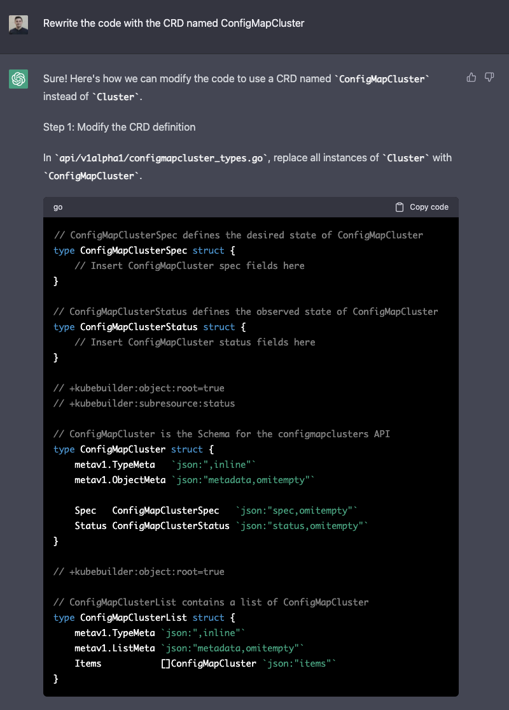
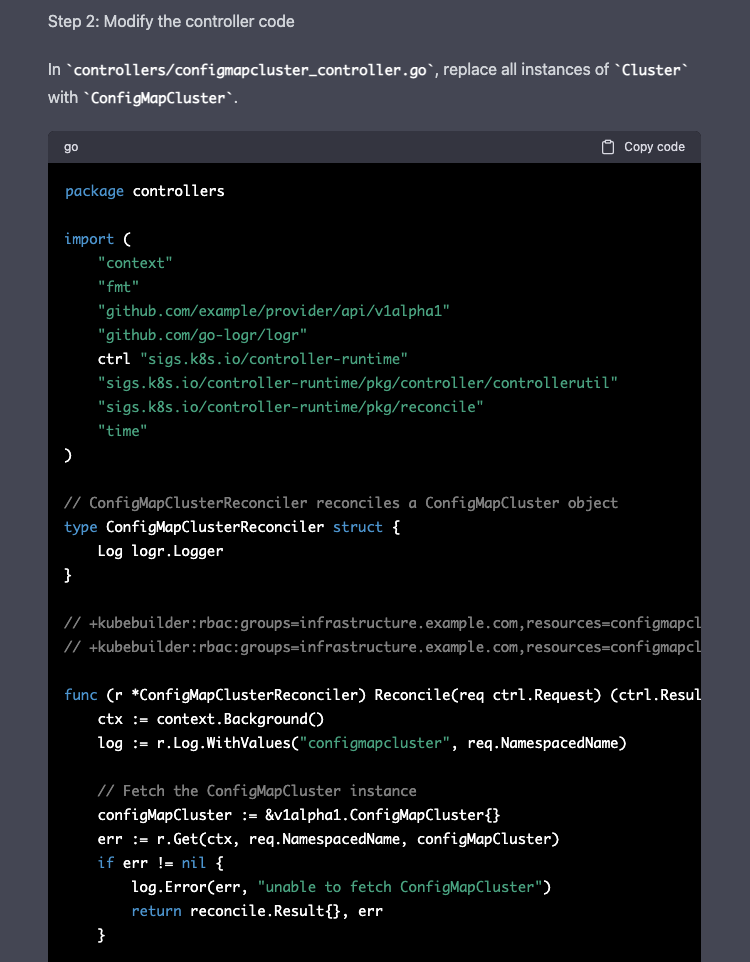
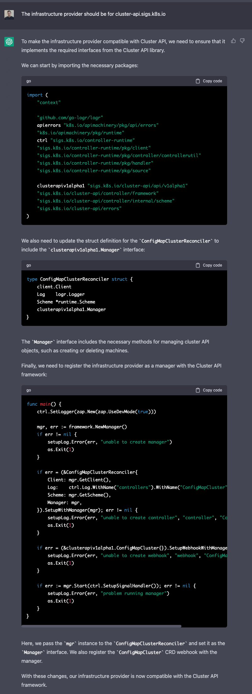
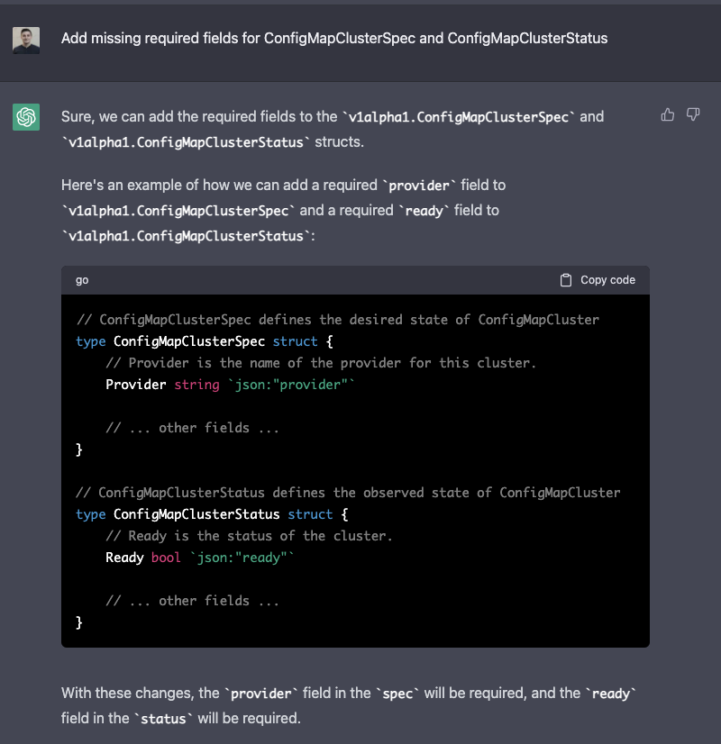
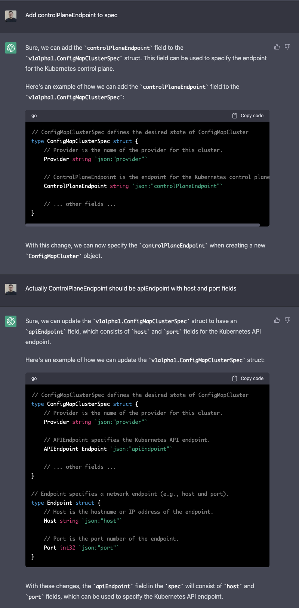
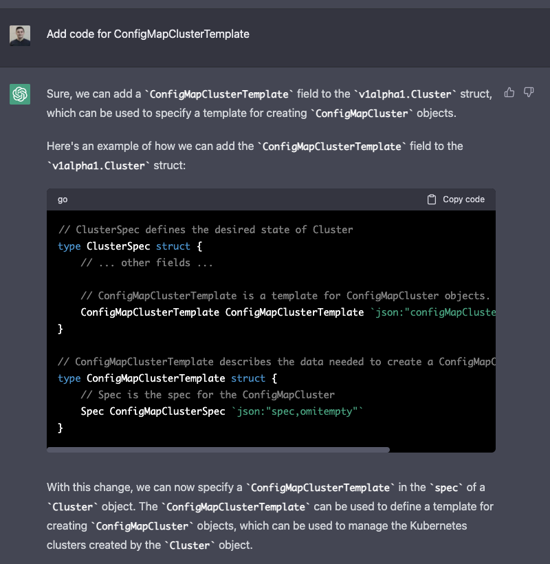
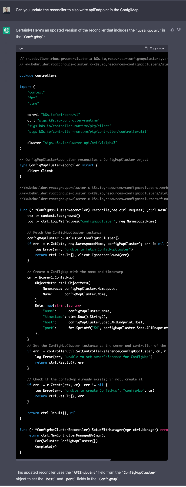
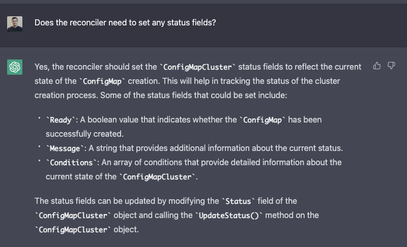

Just like many others, I first heard of [ChatGPT](https://openai.com/blog/chatgpt) at the end of 2022.
But, besides the initial novelty of getting it to write romantic texts to send to my wife or bad jokes to send to my friends, I haven't used it very much after that.
That was until I saw the headlines of Microsoft's Bing AI (powered by an even more advanced version of ChatGPT) [professing its love to a NYT tech columnist Kevin Roose](https://www.nytimes.com/2023/02/16/technology/bing-chatbot-microsoft-chatgpt.html).
As a software engineer, I got curious again and decided to find out if ChatGPT can help do my job (without it trying to break up my marriage in the process).

## ChatGPT Writes a CAPI Infrastructure Provider

### Initial Boilerplate

I wanted to test ChatGPT with something I was already familiar with, but something that was quite challenging.
I decided to have ChatGPT write me a dummy Cluster API infrastructure provider.
Sure there are great [implementation docs](https://cluster-api.sigs.k8s.io/developer/providers/implementers-guide/overview.html) 
and even a [reference implementation for Docker](https://cluster-api.sigs.k8s.io/developer/architecture/controllers/cluster.html?highlight=infrastruct#infrastructure-provider),
but who has time to read all of that, especially if we can have AI do it for us!

Let's give it the initial prompt "Write golang code using kubebuilder to write the cluster API infrastructure provider code"

We are on the right track, it knows that it needs to use [kubebuilder](https://github.com/kubernetes-sigs/kubebuilder) and something about a "Cluster".
It even generated some (incomplete) boilerplate Go code for us (not shown for sake of brevity).

Now let's have ChatGPT use a more meaningful CRD name:

It even updated the reconciler code:

Pretty good so far, but let's give it a hint that we actually want a Cluster API reconciler:

If we compare to what we have so far with the [implementation contract](https://cluster-api.sigs.k8s.io/developer/providers/cluster-infrastructure.html),
there are some required fields that are missing, let's see if ChatGPT can figure those out for us:

Awesome! It understood that the `Ready` field is required. But, looking at the upstream docs we see that `controlPlaneEndpoint` is also required in the Spec.
Let's nudge ChatGPT to give that to us:

Let's prompt ChatGPT to give use one more important part of the contract, a `TemplateSpec`:

### Do Something Useful

At this point, ChatGPT provided a lot of boilerplate code, let's try it to use what the context it has through our interaction
and combine what it has "learned" to have the controller do something a little more useful.

Very cool! ChatGPT knew that it needs to:
1. Get a `configMapCluster` from the Kubernetes API based on the `req`
2. Set the values from `configMapCluster.Spec.APIEndpoint.Host` and `configMapCluster.Spec.APIEndpoint.Port` in the new ConfigMap that is being created. It even correctly converted the `Port` value to a string.
3. Create the `ConfigMap` in the Kubernetes API.

Let's see if it knows anything about the status fields:

Amazing, we know have some code for our infrastructure provider that will use the information from a new Cluster object, save those values and set the proper status.

### Final Thoughts

At this point, ChatGPT has given us lots of useful information. Sure, we can't just copy and paste the code and have it work, but it's a great starting point!
Writing software is complex, but it's also never done in a vacuum chamber.
We all look at existing code and ideas, whether that's in other people's blog posts, or StackOverflow or Github issues. 
ChatGPT can't replace all those sources(at least not as of right now), but it can be another tool that I leverage to make myself a better engineer.

Overall, I was extremely impressed with the conversation I had with ChatGPT. It's been publicly available for only a few months, and I'm excited where the technology goes from here.
